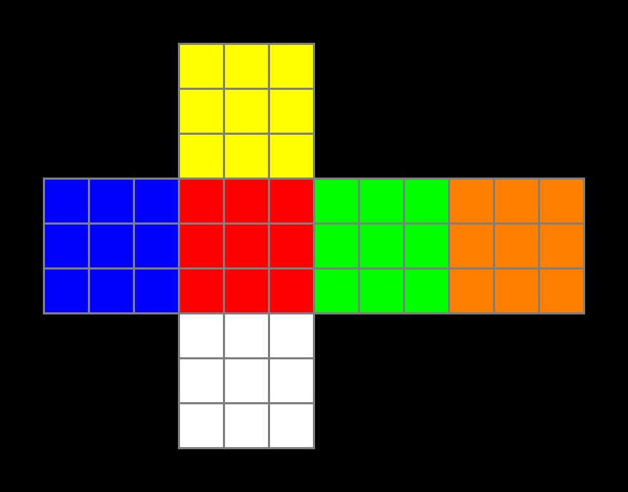
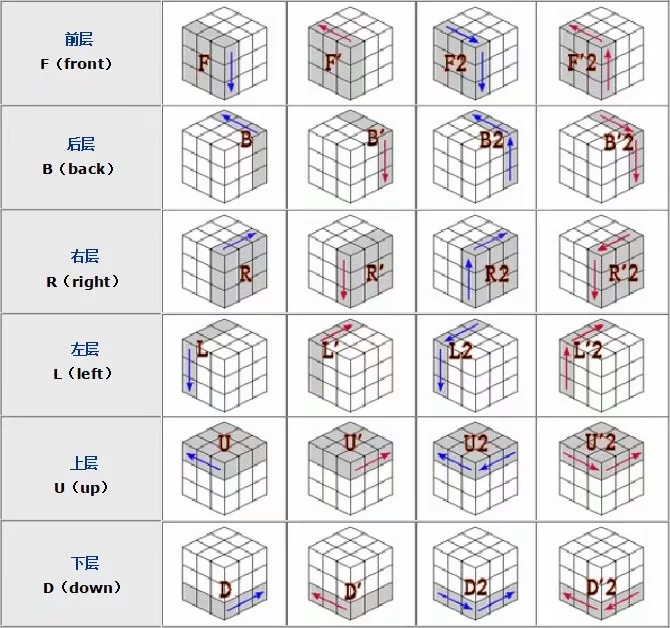
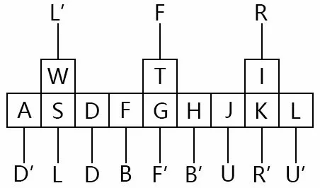
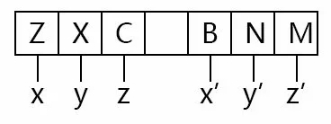

## 运行
```
访问index.html
```

## 操作
w = L'<br>
s = L<br>
a = D'<br>
d = D<br>
t = F<br>
g = F'<br>
f = B<br>
h = B'<br>
i = R<br>
k = R'<br>
j = U<br>
l = U'<br>
z = x<br>
x = y<br>
c = z<br>
b = x'<br>
n = y'<br>
m = z'<br>
0 = 魔方复位<br>
魔方旋转方式图：<br>
<br>
按键图：<br>
<br>
<br>
<br>
## 一些图案
#### 为了方便操作，字母表示键盘按键
六面回字公式：L D G F S K L D<br>
四色回字公式：F2 S I F S2 F T D L F T I2 G S I<br>
对称棋盘公式：S2 I2 T2 F2 J2 D2<br>
循环棋盘公式：D2 T2 L F2 T2 S2 I2 D K F T A J S I D2 J2 G J2<br>
六面十字公式：F2 G S2 I2 D2 F2 T2 S2 I2 J2 G<br>
四面十字公式：D T2 I2 T2 A J I2 T2 I2 L<br>
双色十字公式：L D G F S K L D S2 I2 T2 F2 J2 D2<br>
三色十字公式：F G S2 I2 J A<br>
四色十字公式：J2 I F D F G W L F G S T W I D J2 G K J2<br>
五彩十字公式：S2 A T2 D F D S T K L K A T S2 F T2 S<br>
六面皇后公式：I2 F2 J2 S2 F2 J2 T2 S2 D W I T S2 G L D S<br>
六面五色公式：J F2 S2 F G J G D2 S D2 T D I2 T2 K H L K<br>
六面六色公式：D2 J2 S2 F I2 A S2 I2 D2 F2 T2 L I2 H I2<br>
六面彩条公式：T2 J2 T2 F2 J2 T F<br>
六面三条公式：(J2 S2)3 (J2 I2)3 J D S2 I2<br>
六面凹字公式：T2 W I F2 J2 S K D2<br>
六面凹字公式：J D S2 T2 J A F2 I2 D2<br>
六面凸字公式：T2 I T2 K J2 T2 S J2 F2 J2 G J2 I A F2 D G D2 I T<br>
六面工字公式：D2 S K D2 L2 S K L2<br>
六面Q字公式：D T2 L F G S K D S2 L F I2 H J S2 L<br>
六面J字公式：D2 S2 D I2 J F2 J2 F K H D F2 K T I2 G J K<br>
六面S字公式：S I J D G H S I<br>
六面彩E公式：T2 I2 T2 L K F2 T S K J W I J F J2 T2 A L<br>
六面C J公式：A J F A W I T A H A J S<br>
六面T字公式：J2 T2 I2 D L S2 F2 D J 或者 F2 D2 S K D2 F2 S K<br>
四面Z字公式：( T F I S )3 (J A )2<br>
四面I字公式：I2 T2 I2 S2 T2 S2<br>
四面S字公式：F T D J S2 D L F G<br>
四面O字公式：J I2 S2 J A T2 F2 A<br>
四面E字公式：I2 J2 T2 I2 J2 I2 T2 J2<br>
四面V Y公式：D2 I S J2 I2 S2 J2 I S<br>
四面C J公式：I2 T2 F2 S2 J T2 I2 S2 F2 A<br>
C C T V公式一 F2 I2 D2 J2 T2 S K J2 W K<br>
C C T V公式二 S2 F2 I2 D2 I2 T2 J2 T2 I2 J2 I2<br>
六面斜线公式：F S2 J2 S2 H G J2 K F T I2 A S K A J I G<br>
三色斜线公式：I T2 W D2 T2 W I2 H W H G A J I G D K F K<br>
四面斜线公式：T F S I T F S I T F S I<br>
大小魔方公式：J2 S2 T2 L F2 D I G I G I G A F2 L<br>
大中小魔公式：FW D2SDG D2TA H G IJ2K L FJ2H JT (K D2IH J2F)2<br>
大中小魔公式：T D2 S2 F D H T2 L T J T2 J2 G S D G J<br>
六面弓箭公式：I J T2 A I W T H A G I T2 I J2 T I2 G K L G J2 T I<br>
六面双环公式：F I W A I2 D K S H I2 J F2 L D F2 I S J2 K W F2 A<br>
六面蛇形公式：F I W A I2 D K S H I2 J F2 L D I2 A<br>
彩带魔方公式：D2 W J2 TS2 D2 J I2 D S2 H S2 J S A I2 L<br>
六面鱼形公式：S D F2 J I2 F2 D W F2 G A J K D2 K F2 G L G